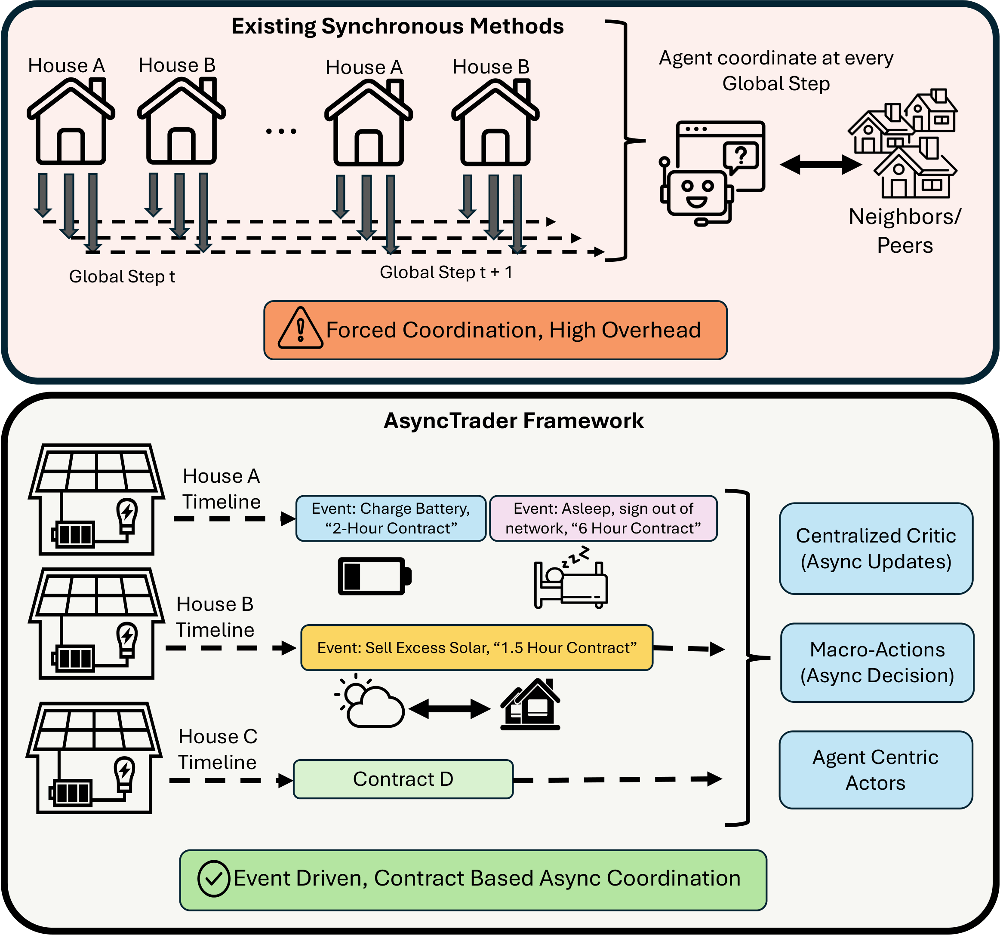

# AsyncTrader

# AsyncTrader: Asynchronous Multi-Agent Reinforcement Learning for P2P Energy Trading

---

## Abstract
The increasing deployment of distributed energy resources is reshaping residential power systems toward more decentralized and locally coordinated operation. Peer-to-peer (P2P) energy trading is a promising approach for coordinating distributed residential energy resources, and multi-agent reinforcement learning (MARL) has recently been used to learn trading and storage policies. However, most existing MARL-based P2P frameworks assume synchronized decision making, where all households observe, communicate, and act at the same fixed timestep. This assumption is difficult to maintain in realistic residential environments, where homes differ in demand, solar generation, battery availability, device capability, and communication reliability. Requiring frequent global synchronization can therefore introduce unnecessary communication overhead and reduce robustness under delayed or intermittent updates. 

To address this challenge, we propose \textbf{AsyncTrader}, an asynchronous MARL framework for residential energy trading. Instead of requiring every household to make a new decision at each global timestep, AsyncTrader models trading behavior through variable-duration macro-actions that remain active until expiration or a significant local event occurs. This event-driven design allows homes to operate on independent timelines and communicate only when needed. To support decision making under stale or missing coordination information, AsyncTrader augments local observations with a compact summary of recent market context. We evaluate AsyncTrader using real household demand and solar data, and show that it maintains strong trading performance under unreliable asynchronous settings, with up to 28.94\% cost savings, 22.71\% energy savings, and 56.43\% lower communication overhead.

---
## Data
We obtain our data from [**Pecan Street**][https://www.pecanstreet.org/dataport/ ].

